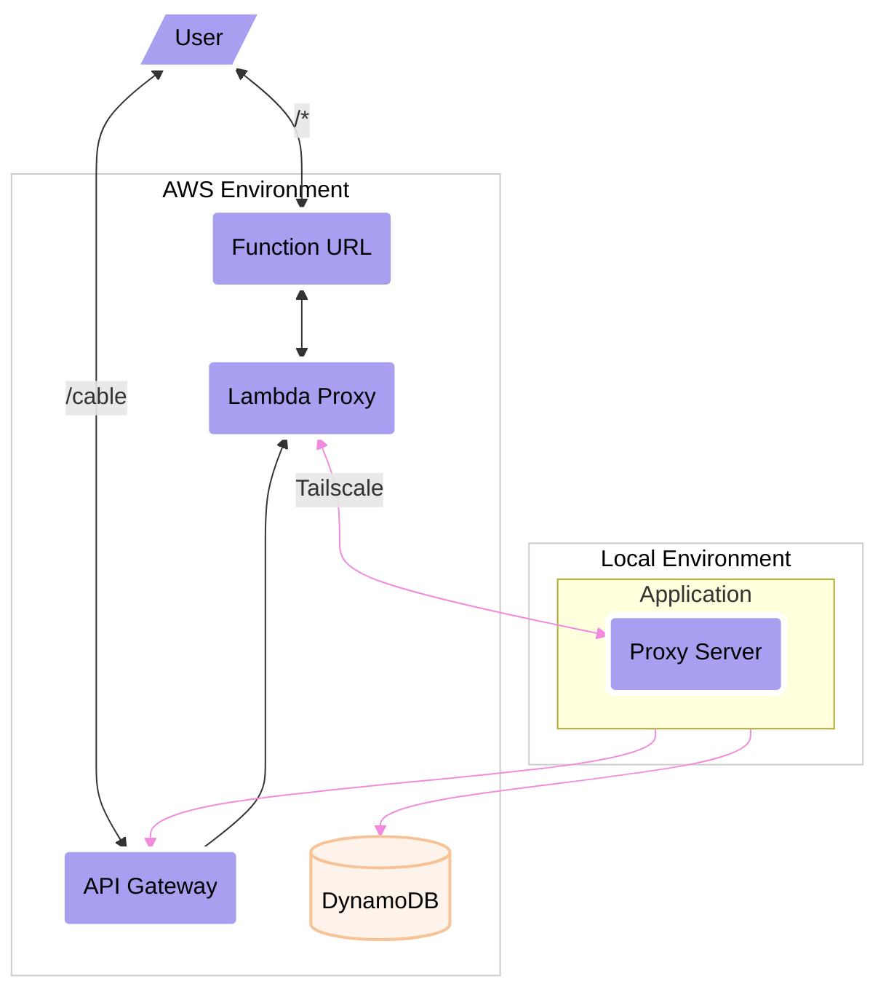

# Tailscale Lambda Extension for Containers

Inspired by [Corey Quinn](https://github.com/QuinnyPig) Tailscale [layer](https://github.com/QuinnyPig/tailscale-layer) project. This project aims to do the same thing but usable for those working with any Lambda Container runtime language.

This Tailscale extension has been modified from Corey's upstream work. We have removed verbose logging and event lifecycle hooks which just did some verbose logging.

## Installation

We have pre-build container packages which include the Tailscale Lambda Extension within a basic Docker scratch image containing everything needed to copy to your `/opt` directory. For example:

```dockerfile
FROM public.ecr.aws/lambda/ruby:3.2
RUN yum install -y curl
COPY --from=ghcr.io/rails-lambda/tailscale-extension-amzn:1 /opt /opt
```

⚠️ Make sure `curl` is installed since the Tailscale Extension script will need it.

### Environment Variables

You will need to generate an [ephemeral key](https://login.tailscale.com/admin/settings/authkeys) within your Tailscale account. Note, this will expire and need updating depending on the time period you select. List of the environment variables include:

- `TS_KEY` - Required. Your ephemeral key.
- `TS_HOSTNAME` - Optional. The value of `--hostname` parameter. Default `lambda`.

### OSs & Architectures

We publish multi-platform images for both `linux/amd64` and `linux/arm64/v8` and we also have Amazon Linux 2 and Debian/Ubuntu variants.

- ghcr.io/rails-lambda/tailscale-extension-amzn
- ghcr.io/rails-lambda/tailscale-extension-debian

## Usage

Once your Lambda function starts, you will have a [SOCKS5](https://en.wikipedia.org/wiki/SOCKS) proxy which can communicate with your Tailscale tailnet at `http://localhost:1055`. Here is an example of how to leverage that with Ruby's [socksify](https://github.com/astro/socksify-ruby) gem.

```ruby
Net::HTTP.socks_proxy('localhost', 1055).start(...) do |http|
  # your http code here...
end
```

Again, this extension is not coupled to any runtime language. So how you use the SOCKS5 proxy is up to you.

## Why? An Example!

I am currently using this extension to help develop our new LambdaCable gem which uses API Gateway's WebSockets. We reached the point where a faster feedback was required. So I use this proxy to forward all Lambda events to my local development. 

In the example image below, the Tailscale Extension is used on the "Lambda Proxy" to send all HTTP and WebSocket event traffic to my local machine, illustrated below.



If you are curious how all this worked with our Lamby gem and our WebSocket demo application, checkout these two pull requests for more details.

- Lamby Gem - [Local Development Proxy Server #164](https://github.com/rails-lambda/lamby/pull/164)
- WebSocket Demo - [Live Development with Tailscale & Lamby #4
](https://github.com/rails-lambda/websocket-demo/pull/4)

### Local Proxy Lessons

When running local development services to be used via a proxy, it is important that you use the `0.0.0.0` address to bind to all local interfaces vs the default of `127.0.0.1`. Doing so will ensure that [Tailscale Services](https://tailscale.com/kb/1100/services/) are updated and available. For Rails development server, use something like this:

```shell
rails s -b 0.0.0.0
```

[Dev Containers](https://containers.dev/) are an amazing technology spec used by great products such as [Codespaces](https://github.com/features/codespaces) and [VS Code Remote Development](https://code.visualstudio.com/docs/remote/remote-overview). If you are using them, you will need to ensure your Dev Container is forwarding the right ports. If your Dev Container is a single image (vs compose), then you can do this  in the `devcotainer.json` file:

```json
{
  "forwardPorts": [3000],
}
```

However, our Rails Lambda Dev Container leverages a `dockerComposeFile`, so you would also have to open that compose file and add this to your `devcontainer.json` matching `service` within the compose file. For example:

```yaml
services:
  app:
    ports:
      - 3000:3000
```

Here are a few helpful GitHub Issues I found on this topic.

- [Add support for devices in devcontainer-feature.json #153](https://github.com/devcontainers/spec/issues/153)
- [Port forwarding issue in Containers #1009](https://github.com/microsoft/vscode-remote-release/issues/1009)
- [Tailscale not detecting Docker Port Forwarding to Host #5813](https://github.com/tailscale/tailscale/issues/5813)

